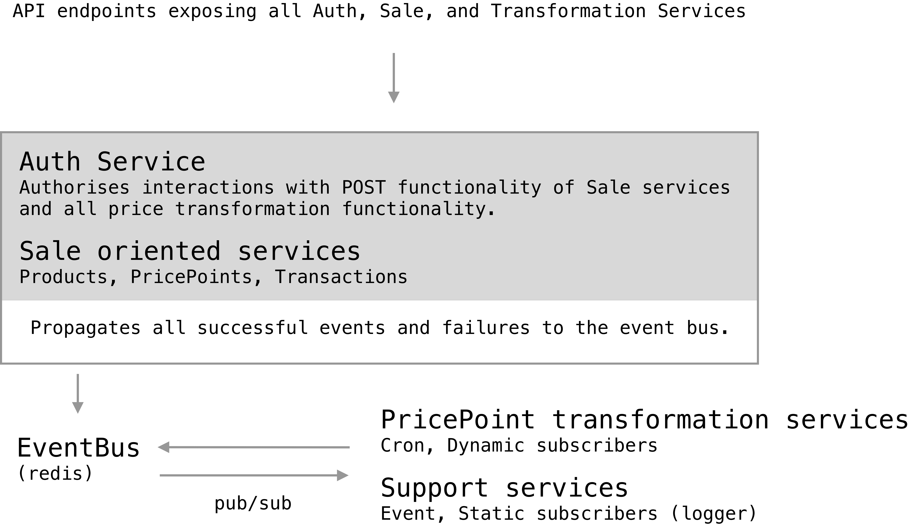

# SPOS (Stock Point of Sales)

Build on `ts`, `postgres (typeorm)`, `redis`, `express`.

To run make sure that;
1. you have `postgres` running (and created a `spos` db).
2. you have `redis` running.
3. you have configured your `.env` file to accomodate `environment.d.ts`.

To then run, you may:
1. Apply migrations - `npm run migration:run` 
2. Seed database with default users (admin and non admin) - `npm run seeding` (optional)
3. npm start to run the project - API served on localhost:3000, logging dashboard on localhost:8000.

To produce new migrations:
`npm run migration:generate --name=<name>`

To run test (creates local sqlite db and in memory redis):
`npm run test`

Overview of spos-backend:
